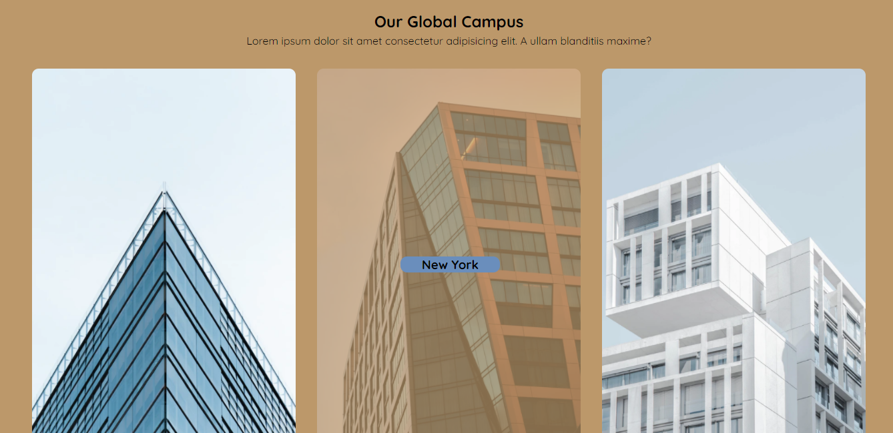
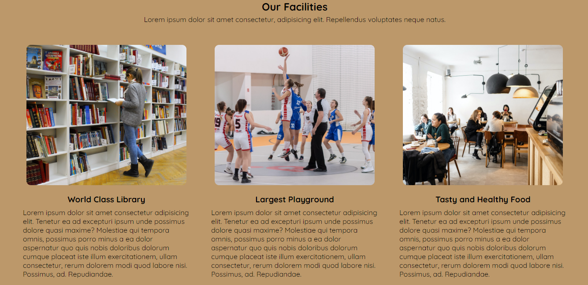
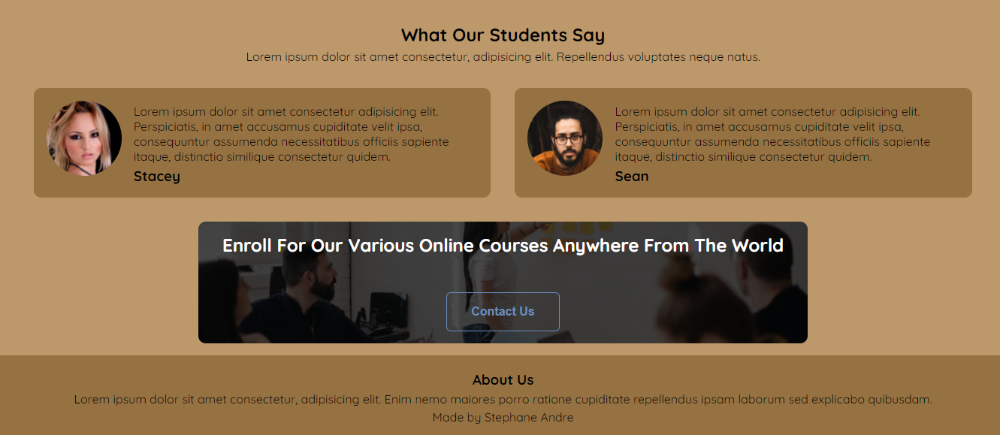
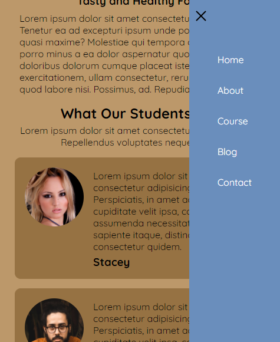
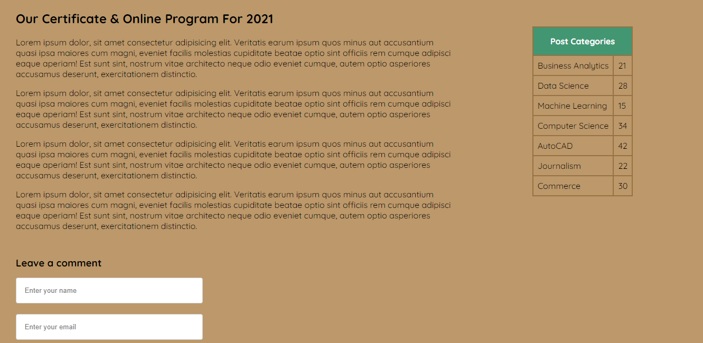
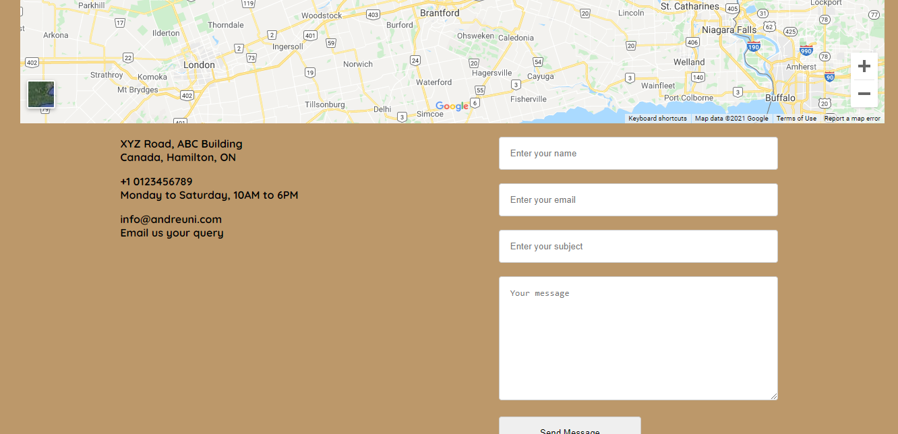

# Andre-University

This website uses HTML, CSS, Javascript. It's also compatible with mobile phones. This website is a template created by Stephane Andre.

## Preview

## Download and Installation

To start using this template, choose one of the following options to get started:

* Clone the repo: `git clone https://github.com/TheStephAndre/Andre-University.git`
* [Fork, Clone, or Download on GitHub](https://github.com/TheStephAndre/Andre-University)

## Usage

### Basic Usage

After downloading, edit HTML, CSS and Javascript with your text editor to make changes. These are the only files you should use. To preview the changes you make to the code, you can open the `index.html` file in your web browser.

## License

