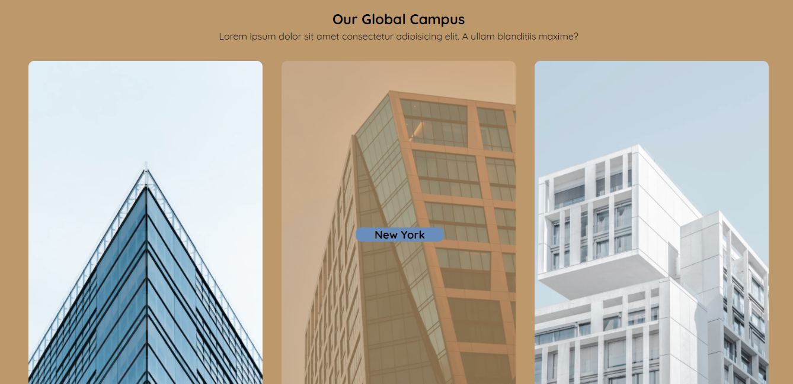
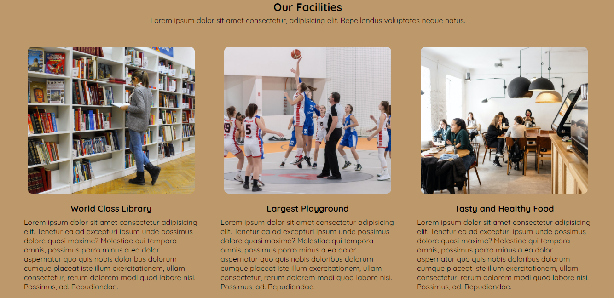
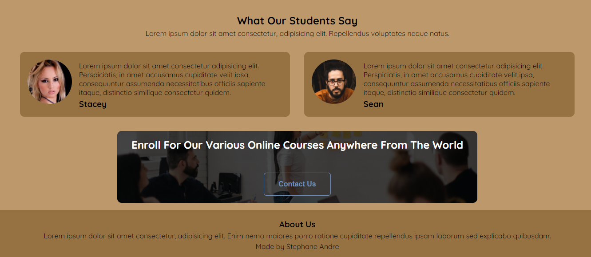
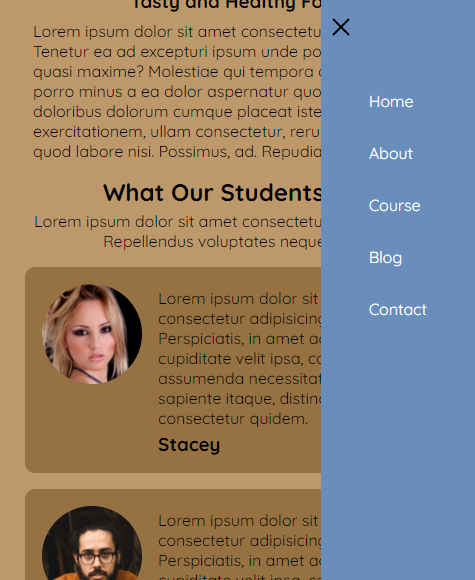
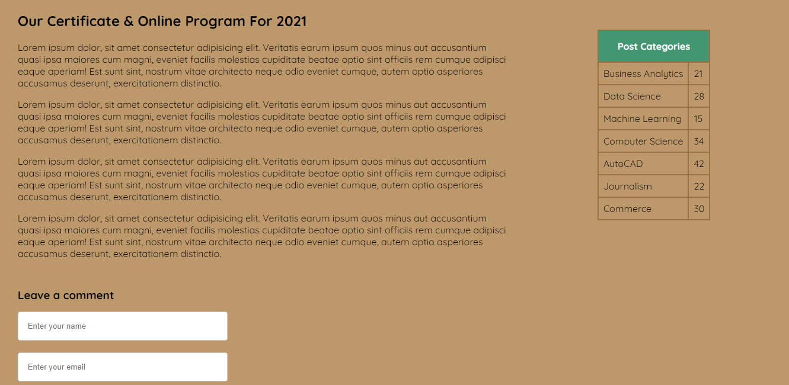
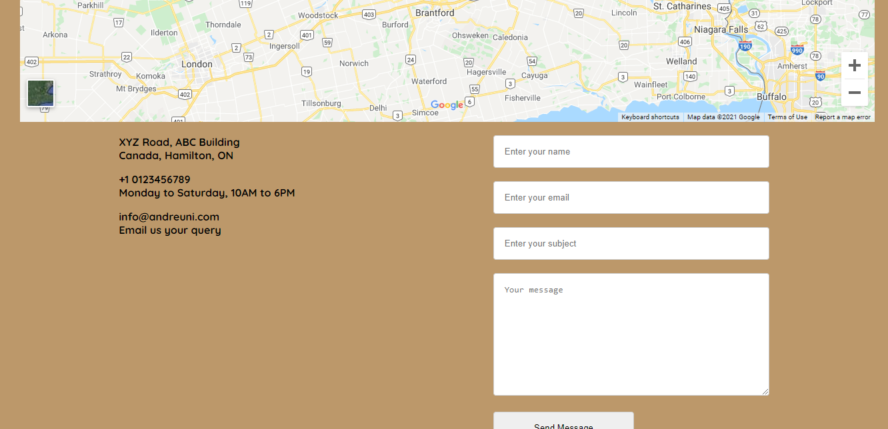

# Andre-University 🎓
**A high-performance, responsive multi-page template for educational institutions.**

[](https://thestephandre.github.io/Andre-University/)


## 🚀 [Live Demo]
Explore the fully functional template here:  
👉 **[https://thestephandre.github.io/Andre-University/](https://thestephandre.github.io/Andre-University/)**

---

## ✨ Features & Technical Implementation

* **Mobile-First Responsive Design**: Engineered with CSS Flexbox and Media Queries to ensure a seamless experience across mobile, tablet, and desktop.
* **Interactive Navigation**: Custom JavaScript-driven mobile menu with focus on smooth UX and accessibility.
* **Semantic HTML Architecture**: Optimized for SEO and screen readers using proper tags (`<header>`, `<nav>`, `<main>`, `<article>`, `<footer>`).
* **Multi-Page Routing**: Includes structured templates for About, Course, Blog, and Contact pages.
* **Typography & Performance**: Balanced font-loading strategy using Google Fonts (Quicksand) for professional aesthetics without sacrificing speed.

## 🛠️ Tech Stack & Best Practices

* **HTML5/CSS3**: Pure CSS layouts without heavy frameworks (Bootstrap/Tailwind) to maintain a lightweight footprint.
* **JavaScript (Vanilla)**: Decoupled logic in `script.js` for modularity and maintainability.
* **Clean Code**: Strictly follows the **Separation of Concerns** principle (Structure vs. Style vs. Logic).

## Preview

















## 📥 Installation & Customization

1.  **Clone the repository:**
    ```bash
    git clone [https://github.com/TheStephAndre/Andre-University.git](https://github.com/TheStephAndre/Andre-University.git)
    ```
2.  **Usage:**
    Modify the CSS variables and `index.html` to adapt the branding. The project is "ready-to-host" on any static provider like GitHub Pages or Vercel.

---
**Created by Stephane Andre** *License: MIT*

